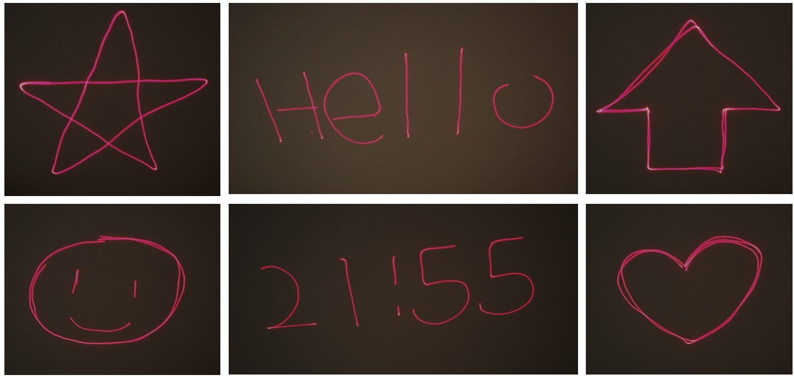
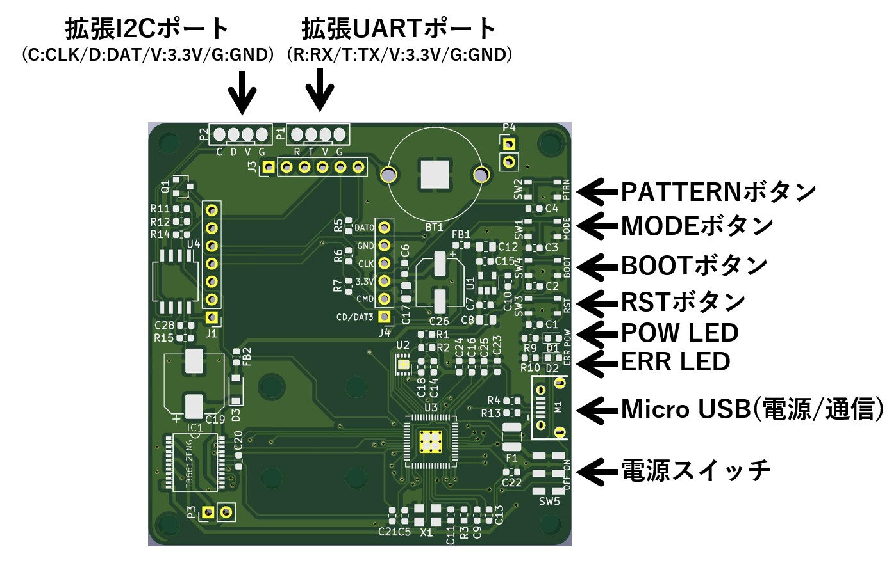
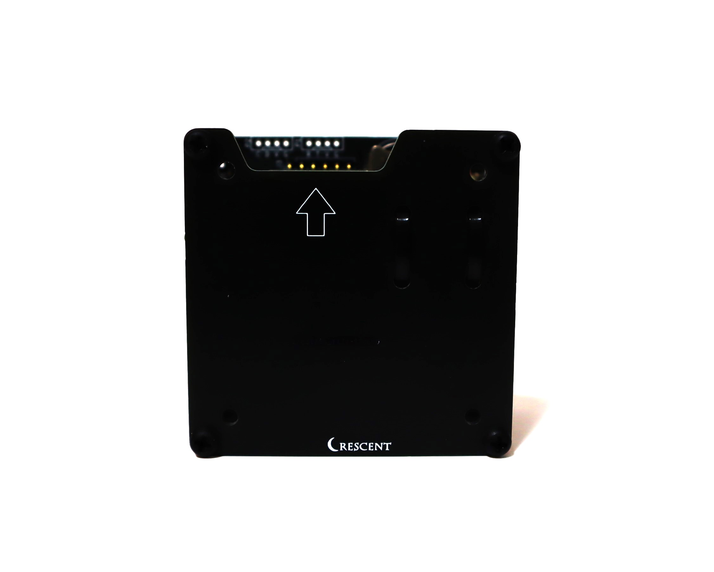
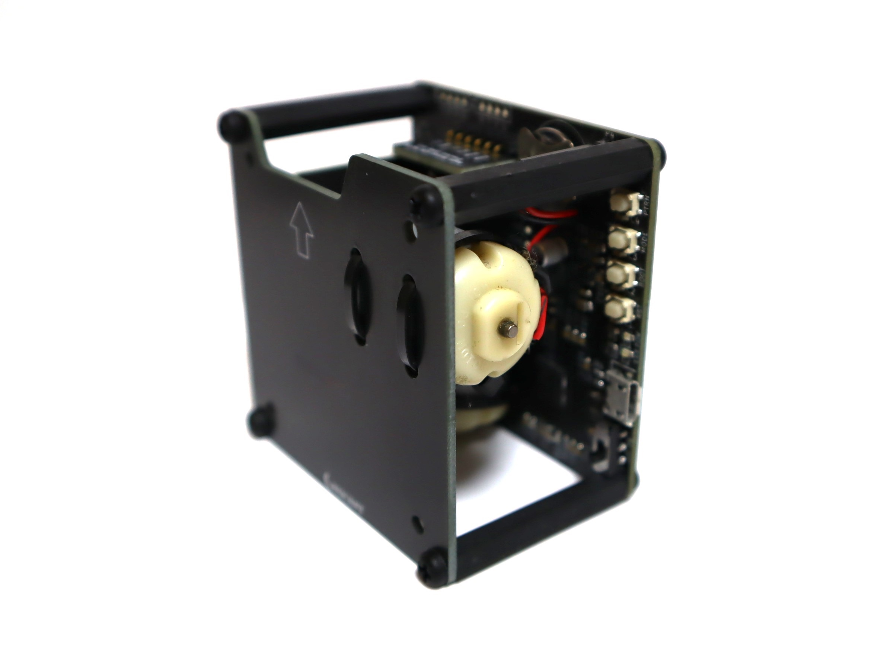
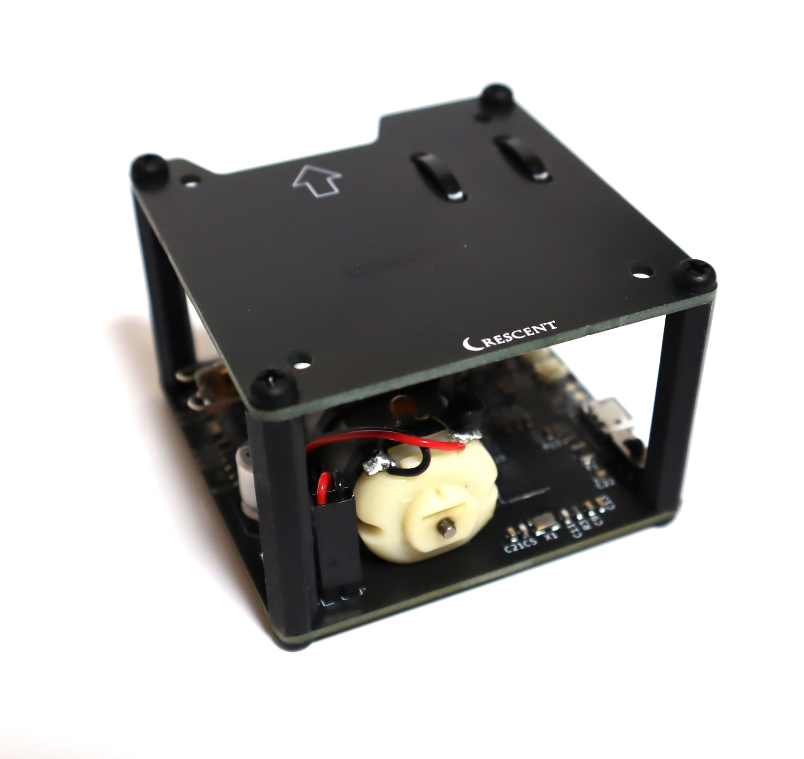
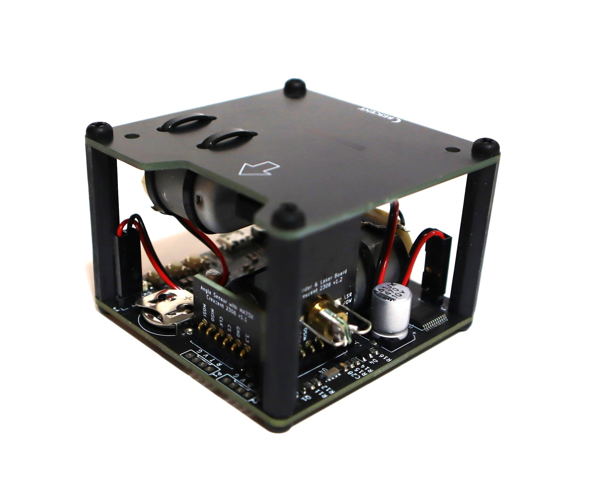

# 簡易レーザープロジェクタ ProjectionBall Unit

## 概要 
  * ロボット制御技術を応用したガルバノスキャナ方式の簡易レーザープロジェクタです  
  * 文字や時刻、日時、内蔵図形を描画することが可能です  
  * 本体ボタン、PCのCOMポートやUARTを介して設定を変更することが可能です  
  * 任意の文字列は英数字を最大5文字同時表示、それ以上は32文字までスクロール表示可能です  
  * 投影距離は明るい場所で数m以下、暗い場所で10m以下が目安です  
  * Pico-SDKを使用したソースコードを公開しています  
 

## 仕様  
  * 電源スイッチ、モード切替、パターン切替、BOOTボタン、RESETボタンを搭載しています  
  * マイコンRP2040、RTC SD3077、モータFA-130、ドライバTB6612、エンコーダMA732Qを使用しています    
  * 赤色レーザーモジュール(出力1mW以下、ClassⅡ同等品)  
  * 5V/0.8AのUSB電源(micro USB)で動作  
  * 電源LED(青)、エラーLED(オレンジ)を搭載  
  * 時刻(RTC)/設定データ一時保存用電池 CR1220  
  * シリアルポートP1 ボーレート9600bps、データサイズ8bit、パリティ無、ストップ1bitが既定値
  * サイズ60mm x60mm x 43mm(突起部、USBコネクタ除く)、固定穴45mm x45mm M3x4

## アプリケーション例
  * 移動ロボットに組込して進路を表示  
  * イベント等での情報を表示  

## 注意点
  * レーザーを使用しているため、光源を直視しないでください  
  * 目にレーザー光が入る可能性があるため、人や動物に対して投影しないでください    
  * 汎用モータを使用しているため、描画のちらつきや崩れがあります    
  * ガルバノミラーはガラス製表面鏡のため、手を触れなでください  
  * 光軸がずれる可能性があるため、落下や衝撃を与えないでください  
  * 本製品は研究、開発目的の用途を想定しています  
  * 起動後にエラーLEDが点灯する場合はミラー部分が回転できるか、引っかかりがないか確認し、電源を入れ直してください    
  * 告知なしに部品や仕様を変更する場合があります  

## 使い方
### a.単体で使用する場合  
　microUSBをUSB電源等に接続し、電源スイッチ、モード切替、パターン切替スイッチで操作することが可能です    

### b.他の機器と連携する場合  
　microUSBをUSB電源等に接続し、P1端子を介してUART通信(ボーレート9600bps, 3.3V)可能です  
  マイコン等からコマンドを送信して制御することが可能です  

### c.設定を行う場合
　PC等にmicroUSBを接続し、Teraterm等からシリアルポートを介してコマンドで設定を行うことが可能です  

### d.ファームウェアの書換を行う場合
　PC等にmicroUSBを接続し、BOOTボタンを押した状態でRSTボタンを押すとUSBドライブとして認識されます  
  ファームウェアファイル(*.uf2)を認識されたUSBドライブに書き込むことでファームの書換が可能です  

## 描画モード

  * パターン0: 星
  * パターン1: 矢印
  * パターン2: メール
  * パターン3: スマイル
  * パターン4: 太陽
  * パターン5: 雲
  * パターン6: 傘
  * パターン7: 雪だるま
  * パターン8: 雲と雷
  * パターン9: ハート  

## 描画パターン   
  * モード0: 通常描画
  * モード1: 一筆書き描画
  * モード2: 回転描画
  * モード3: デジタル時計
  * モード4: デジタル日付
  * モード5: 任意メッセージ  
※メッセージは英数字、最大5文字、それ以上はスクロール表示です  

## 描画例

## 各部機能

## コマンド
  * コマンド文字列を送信することで描画モードやパターン等の設定が可能です  
  * 改行コードは"\r\n"がデフォルトです  

### 日時設定コマンド  
| コマンド名 | コマンド | 引数 | 例 | 
|:-----------|:------------|:------------|:------------|
| 時刻設定 | tim= | hhmmss | tim=220212(Enterキー) |
| 時刻確認 | tim? | なし | tim?(Enterキー) |
| 日時設定 |	day= | YYMMDD | day=220305(Enterキー) | 
| 日時確認 |	day? | なし | day?(Enterキー) | 	

※日付時刻は必ずそれぞれ2桁で入力してください  
　例　2時8分01秒→tim=020801 

### 制御コマンド  
| コマンド名 | コマンド | 引数 | 例 | 
|:-----------|:------------|:------------|:------------|
| モード確認 |	mod? | なし | mod?(Enterキー) |   
| モード設定 |	mod= | モード | mod=1(Enterキー) |   
| パターン確認 |	ptn? | なし | ptn?(Enterキー) |   
| パターン設定 |	ptn= | パターン| ptn=2(Enterキー) |   
| ソフトリセット | rst! | なし | rst!(Enterキー) |  
| 描画一時停止 | pus! | なし | pus!(Enterキー) |
| 描画再開 |	rsm! | なし | rsm!(Enterキー) | 
| 描画角設定 |	deg= | 角度 | deg=90(Enterキー) | 	
| 描画角確認 |	deg? | なし | deg?(Enterキー) | 	

※描画角は描画の上下左右等の角度を変更する場合に使用します  

### ユーザ設定コマンド  
| コマンド名 | コマンド | 引数 | 例 | 
|:-----------|:------------|:------------|:------------|
| 描画文字列確認 |	str? | なし | str?(Enterキー) |   
| 描画文字列設定(MEM) |	str= | 英数字 | str=Hello(Enterキー) |   
| 描画文字列設定(RAM) |	stg= | 英数字 | stg=Hello(Enterキー) |  

※MEMの場合、文字列はメモリに保存され、自動的に再起動します  
※RAMの場合、文字列は即時反映されますが、電源再投入等でメモリに保存された文字列に戻ります  

### タイマ設定コマンド  
| コマンド名 | コマンド | 引数 | 例 | 
|:-----------|:------------|:------------|:------------|
| タイマ確認 |	tst? | なし | tst?(Enterキー) |   
| タイマ有効化 | ten! | なし | ten!(Enterキー) |  
| タイマ無効化 | tds! | なし | tds!(Enterキー) |
| 停止時刻確認 |	pus? | なし | pus?(Enterキー) | 
| 停止時刻設定 |	pus= | hhmm | pus=1230(Enterキー) | 
| 再開時刻確認 |	rsm? | なし | pus?(Enterキー) | 
| 再開時刻設定 |	rsm= | hhmm | pus=1530(Enterキー) | 

※タイマ確認は0で無効状態、1で有効状態を示しています  

### キャリブレーションコマンド  
| コマンド名 | コマンド | 引数 | 例 | 
|:-----------|:------------|:------------|:------------|  
| 描画中心確認 |	cen? | なし | cen?(Enterキー) |   
| 描画中心設定 |	cen= | X,Y | cen=100,-200(Enterキー) |   

※レーザーが基板や筐体に当たって描画が隠れてしまう場合にのみ、描画中心を調整します  
※描画中心のキャリブレーション値は出荷時に調整しています    
※キャリブレーション値は初期値に対してX軸(縦方向)、Y軸(横方向)のオフセット値を設定します  

## 外観

  

  
License - MIT
